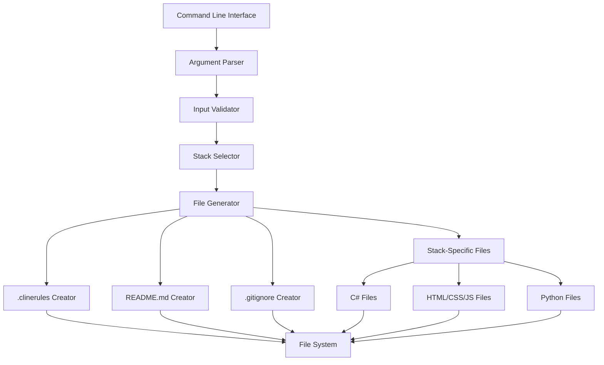

# System Patterns: Project Configuration Tool

## Architecture Overview


## Core Components

### 1. Command Line Interface
- Entry point for the application
- Accepts project directory path argument
- Provides feedback on operation status

### 2. Argument Parser
- Validates directory path
- Handles relative and absolute paths
- Manages command-line options
- Processes stack parameter

### 3. File Generator
- Creates files using templates
- Handles file system operations
- Ensures atomic operations
- Prevents overwriting existing files without permission

### 4. Error Handling
- Clear error messages
- Graceful failure handling
- User-friendly feedback
- Recovery suggestions

## Design Patterns

### 1. Template Method Pattern
Used for file generation to maintain consistent structure while allowing for customization.

### 2. Factory Pattern
Handles creation of different file types (.clinerules and readme.md).

### 3. Strategy Pattern
Manages different file generation strategies based on context.

## Implementation Guidelines

### File Generation
```csharp
public interface IFileGenerator
{
    void Generate(string path);
}

public class StackSpecificGenerator : IFileGenerator
{
    private readonly string _stack;
    public StackSpecificGenerator(string stack) 
    {
        _stack = stack;
    }

    public void Generate(string path)
    {
        switch (_stack)
        {
            case "csharp":
                GenerateCSharpFiles(path);
                break;
            case "html":
                GenerateHtmlFiles(path);
                break;
            case "python":
                GeneratePythonFiles(path);
                break;
            default:
                throw new ArgumentException("Invalid stack");
        }
    }

    private void GenerateCSharpFiles(string path) { ... }
    private void GenerateHtmlFiles(string path) { ... }
    private void GeneratePythonFiles(string path) { ... }
}

public class ClineruleGenerator : IFileGenerator
{
    public void Generate(string path) { ... }
}

public class ReadmeGenerator : IFileGenerator
{
    public void Generate(string path) { ... }
}

public class GitignoreGenerator : IFileGenerator
{
    public void Generate(string path) { ... }
}
```

### Path Handling
- Use `Path.Combine()` for cross-platform compatibility
- Validate paths before operations
- Handle relative paths correctly

### Error Management
- Use custom exceptions for specific error cases
- Provide clear error messages
- Include recovery suggestions

## Critical Implementation Paths
1. Command-line argument processing
2. Directory validation and creation
3. File template application
4. Error handling and user feedback
